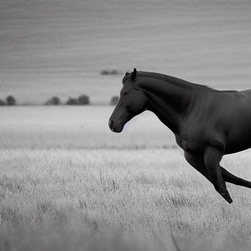
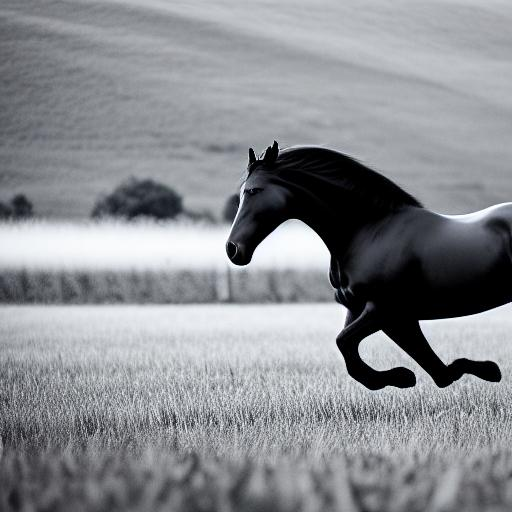
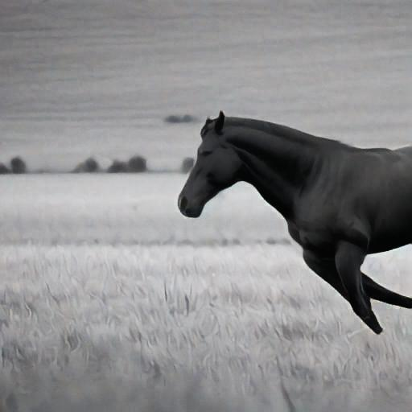
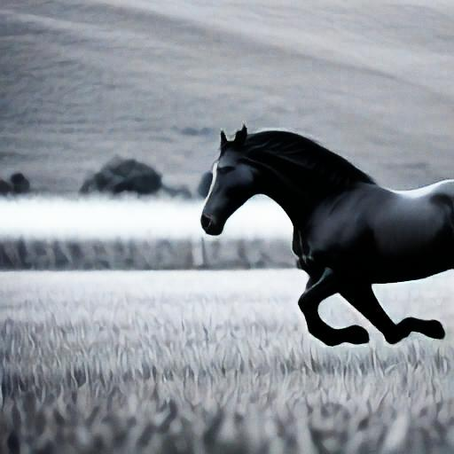

<h1>MDecoder For Stable Diffusion On Super Fast Preview In TensorFlow 2</h1>

<strong>Note: </strong>
<strong>Currently released version only supports 512x512 resolution</strong>

<strong>FreeU In TensorFlow</strong>

<strong>MDecoder For Fast Preview</strong>

## FreeU Parameters

Feel free to adjust these parameters based on your models, image/video style, or tasks. The following parameters are for
reference only.

### SD1.x:

**b1**: 1.2, **b2**: 1.4, **s1**: 0.9, **s2**: 0.2

### SD2.x

**b1**: 1.1, **b2**: 1.2, **s1**: 0.9, **s2**: 0.2

### Range for More FreeU Parameters

When trying additional parameters, consider the following ranges:

- **b1**: 1 ≤ b1 ≤ 1.2
- **b2**: 1.2 ≤ b2 ≤ 1.6
- **s1**: s1 ≤ 1
- **s2**: s2 ≤ 1

Distributed under the MIT License. See `LICENSE` for more information.

## Credits

Licenses for borrowed code can be found in following link:

- FreeU - https://github.com/ChenyangSi/FreeU
- KerasCV - https://github.com/keras-team/keras-cv

## Donating

If this project useful for you, please consider buying me a cup of coffee or sponsoring me!

